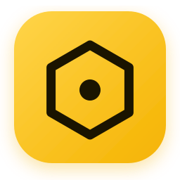
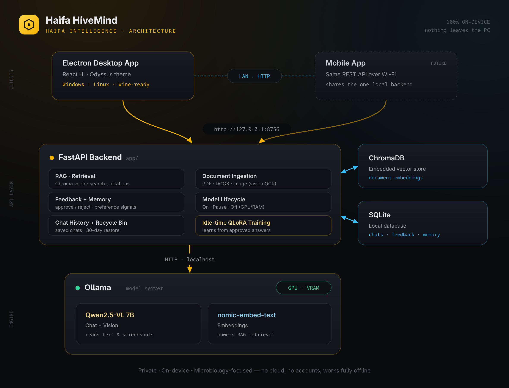

<p align="center">
  
</p>

<h1 align="center">Haifa HiveMind</h1>

<p align="center"><b>A local, private research AI — by Haifa Intelligence.</b></p>

<p align="center">
  Runs entirely on the client's own machine — no cloud, no data leaves the PC.<br/>
  Built for microbiology research: upload papers (PDF / DOCX), drop screenshots,<br/>
  ask grounded questions, and let it <b>learn from your feedback</b> over time.
</p>

<p align="center">
  <a href="https://haifa-hivemind-git-main-danial-dirars-projects.vercel.app"></a>
</p>

<p align="center"><sub>👆 Interface preview only (sample data). The real AI runs locally — see <a href="#live-demo-interface-only--vercel">install</a>.</sub></p>

<p align="center">
  
  
  
</p>

---

## Download

Grab the latest build from the
[**Releases**](https://github.com/Danial-Dirar/haifa-hivemind/releases) page:

- **Windows** — `Haifa HiveMind Setup <version>.exe` (installer)
- **Linux** — `Haifa HiveMind-<version>.AppImage`

You'll also need **[Ollama](https://ollama.com/download)** installed and the
models pulled once — see [`CLIENT_GUIDE.md`](CLIENT_GUIDE.md). The packaged app
bundles everything except the optional QLoRA fine-tuning, which needs a separate
Python + CUDA setup (`requirements-train.txt`).

## What it does

- 📄 **Ingest** PDF, DOCX, TXT and **image** documents into a private knowledge base.
- 🔬 **Answer** questions grounded in *your* library, with inline source citations.
- 🖼️ **See** — dropped screenshots are read by a vision model (Qwen2.5-VL).
- 👍👎 **Learn** — approve/reject each answer. Rejections trigger an instant rethink
  or a clarifying question; approvals feed a periodic **QLoRA fine-tune**.
- 💬 **Remember** — every conversation is saved and searchable. Deleting a chat
  moves it to a **30-day recycle bin** with one-click restore (auto-purged after).
- 🔌 **Power controls** — On / Pause / Off so the AI only uses GPU + RAM when wanted.

> **Layout:** the chat fills the left; a control rail on the right holds power
> controls, chat history + recycle bin, the document library, and self-improvement.

## Architecture



<sub>Source: [`docs/architecture.svg`](docs/architecture.svg)</sub>

**Why API-first:** one local backend serves every client. Today it's the Electron
desktop app; a mobile app later just points at the same machine over the LAN.
Electron (bundled Chromium) is used so the Windows build also runs cleanly under
**Wine** on Linux — and we ship a **native Linux AppImage** too, which avoids Wine
entirely.

## Repo layout

| Path        | What                                                        |
|-------------|-------------------------------------------------------------|
| `backend/`  | Python FastAPI — RAG, chat history, feedback, lifecycle, training |
| `frontend/` | Vite + React UI (built into static assets)                  |
| `desktop/`  | Electron shell — spawns/supervises the backend              |
| `scripts/`  | One-time model bootstrap (`setup_models.*`)                 |

## Prerequisites (dev)

- **Python 3.11 or 3.12** (⚠️ not 3.14 yet — some ML wheels are unavailable)
- **Node 18+**
- **Ollama** — <https://ollama.com/download>
- An **NVIDIA GPU** (client target: 16 GB VRAM). CPU works but is slow.

## Run it in development

```bash
# 1. Models (once)
./scripts/setup_models.sh            # or scripts\setup_models.bat on Windows

# 2. Backend
cd backend
python -m venv .venv && source .venv/bin/activate
pip install -r requirements.txt
python run.py                        # -> http://127.0.0.1:8756

# 3. Frontend (new terminal)
cd frontend
npm install
npm run dev                          # -> http://localhost:5219

# 4. Desktop shell (optional, new terminal)
cd desktop
npm install
HIVEMIND_DEV=1 HIVEMIND_VITE=http://localhost:5219 npm run dev
```

## Build a shippable installer

```bash
cd frontend && npm run build                 # compile the UI
cd ../backend && pyinstaller hivemind-backend.spec   # bundle backend -> dist/
cd ../desktop && npm install
npm run dist:win      # Windows .exe installer  (release/)
npm run dist:linux    # Linux AppImage
```

`electron-builder` packages the compiled UI (`web/`) and the backend binary into
one installer. See [`CLIENT_GUIDE.md`](CLIENT_GUIDE.md) for the end-user steps.

## Live demo (interface only) — Vercel

**▶ Live:** <https://haifa-hivemind-git-main-danial-dirars-projects.vercel.app>

The UI can be deployed to Vercel as a **static interface preview**. There's no
backend or AI in the demo — it runs on sample data, streams a canned reply, and
shows a ribbon pointing users back here to install the real thing. Demo mode is
auto-detected from the hostname (anything that isn't `localhost`).

Deploy:

1. On [vercel.com](https://vercel.com), **Import** this GitHub repo.
2. Set **Root Directory** to `frontend` — the framework auto-detects as **Vite**
   (Build `npm run build`, Output `dist`). Nothing else to change.
3. Deploy. (Optional: set `VITE_DEMO=1` to force demo mode anywhere.)

> The desktop app and local dev (`localhost`) always run in **full mode** against
> the real backend — only public hosts fall back to the demo.

## The learning loop

1. **Instant** — every reject can add an *avoid* memory and re-answer from a new
   angle or ask a clarifying question; approvals can add *prefer* memories. These
   steer the system prompt immediately (`app/core/memory.py`).
2. **Durable** — approved Q&A pairs queue up; when the client hits **Fine-tune
   now** (or the box is idle) a 4-bit **QLoRA** run adapts the model and registers
   a new Ollama tag (`app/training/lora.py`).

> Fine-tuning the *vision* tower is a later phase; the current trainer adapts the
> language behaviour, which is where the feedback signal lives.

## Configuration

Everything is overridable via `HIVEMIND_*` env vars or `backend/.env`
(see `backend/.env.example`). Common ones: `HIVEMIND_CHAT_MODEL`,
`HIVEMIND_PORT`, `HIVEMIND_OLLAMA_URL`.
